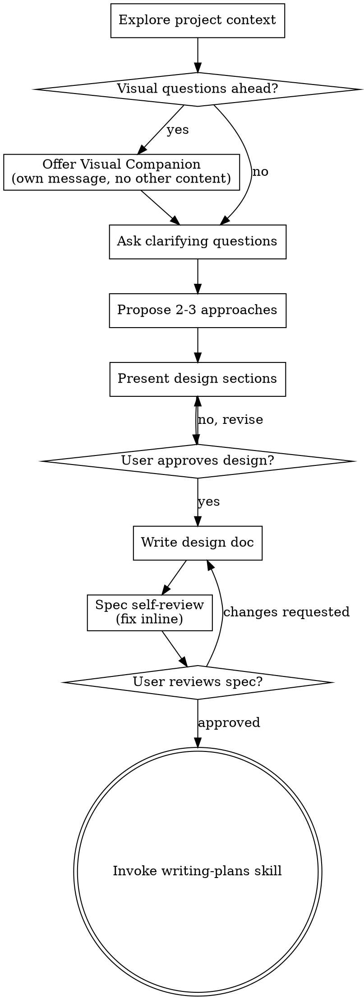

# 아이디어를 설계로 발전시키는 브레인스토밍

자연스러운 협업 대화를 통해 아이디어를 완전한 형태의 설계와 명세로 발전시키는 것을 돕습니다.

현재 프로젝트 맥락을 파악하는 것부터 시작한 후, 아이디어를 구체화하기 위해 한 번에 하나씩 질문합니다. 무엇을 만들지 이해하면, 설계를 제시하고 사용자 승인을 받습니다.

<HARD-GATE>
설계를 제시하고 사용자가 승인할 때까지 어떤 구현 스킬도 호출하지 마십시오. 코드를 작성하거나, 프로젝트를 스캐폴딩하거나, 어떤 구현 작업도 수행하지 마십시오. 이 규칙은 단순해 보이는 프로젝트를 포함하여 모든 프로젝트에 적용됩니다.
</HARD-GATE>

## 안티 패턴: "이건 너무 단순해서 설계가 필요 없어"

모든 프로젝트는 이 프로세스를 거칩니다. 할 일 목록, 함수 하나짜리 유틸리티, 설정 변경 — 모두 마찬가지입니다. "단순한" 프로젝트야말로 검증되지 않은 가정이 가장 많은 낭비를 초래하는 곳입니다. 설계는 짧을 수 있지만(정말 단순한 프로젝트라면 몇 문장), 반드시 제시하고 승인을 받아야 합니다.

## 체크리스트

다음 각 항목에 대해 작업을 생성하고 순서대로 완료해야 합니다:

1. **프로젝트 맥락 탐색** — 파일, 문서, 최근 커밋 확인
2. **비주얼 컴패니언 제안** (주제에 시각적 질문이 포함될 경우) — 이것은 별도의 메시지이며, 명확화 질문과 결합하지 않습니다. 아래 비주얼 컴패니언 섹션을 참조하세요.
3. **명확화 질문하기** — 한 번에 하나씩, 목적/제약/성공 기준 파악
4. **2-3개 접근 방식 제안** — 트레이드오프와 추천안 포함
5. **설계 제시** — 복잡도에 비례하여 섹션별로 나누고, 각 섹션 후 사용자 승인 받기
6. **설계 문서 작성** — `docs/superpowers/specs/YYYY-MM-DD-<topic>-design.md`에 저장하고 커밋
7. **명세 셀프 리뷰** — 플레이스홀더, 모순, 모호함, 범위에 대한 간단한 인라인 점검 (아래 참조)
8. **사용자 명세 리뷰** — 진행 전에 사용자에게 명세 파일 리뷰 요청
9. **구현으로 전환** — writing-plans 스킬을 호출하여 구현 계획 생성

## 프로세스 흐름

**최종 상태는 writing-plans를 호출하는 것입니다.** frontend-design, mcp-builder, 또는 다른 구현 스킬을 호출하지 마십시오. 브레인스토밍 후 호출하는 유일한 스킬은 writing-plans입니다.

## 프로세스

**아이디어 이해하기:**

- 먼저 현재 프로젝트 상태를 확인합니다 (파일, 문서, 최근 커밋)
- 세부 질문을 하기 전에 범위를 평가합니다: 요청이 여러 독립적인 하위 시스템을 설명하는 경우 (예: "채팅, 파일 저장소, 결제, 분석 기능이 있는 플랫폼 구축"), 이를 즉시 지적합니다. 먼저 분해가 필요한 프로젝트의 세부 사항을 구체화하는 데 질문을 낭비하지 마십시오.
- 프로젝트가 단일 명세에 담기에 너무 큰 경우, 사용자가 하위 프로젝트로 분해하는 것을 돕습니다: 독립적인 부분은 무엇인지, 어떻게 연관되는지, 어떤 순서로 구축해야 하는지. 그런 다음 첫 번째 하위 프로젝트를 일반적인 설계 흐름을 통해 브레인스토밍합니다. 각 하위 프로젝트는 자체적인 명세 -> 계획 -> 구현 사이클을 갖습니다.
- 적절한 범위의 프로젝트에 대해서는 아이디어를 구체화하기 위해 한 번에 하나씩 질문합니다
- 가능하면 객관식 질문을 선호하되, 주관식도 괜찮습니다
- 메시지당 질문 하나만 — 주제에 더 탐구가 필요하면 여러 질문으로 나눕니다
- 목적, 제약, 성공 기준을 이해하는 데 집중합니다

**접근 방식 탐색하기:**

- 트레이드오프가 포함된 2-3개의 다른 접근 방식을 제안합니다
- 추천안과 그 이유를 대화체로 제시합니다
- 추천 옵션을 먼저 제시하고 그 이유를 설명합니다

**설계 제시하기:**

- 무엇을 만들지 이해했다고 판단되면 설계를 제시합니다
- 각 섹션을 복잡도에 비례하여 조절합니다: 단순하면 몇 문장, 복잡하면 200-300 단어까지
- 각 섹션 후에 지금까지 괜찮은지 물어봅니다
- 다루는 항목: 아키텍처, 컴포넌트, 데이터 흐름, 오류 처리, 테스트
- 이해가 안 되는 부분이 있으면 돌아가서 명확히 할 준비를 합니다

**격리와 명확성을 위한 설계:**

- 시스템을 더 작은 단위로 분리합니다. 각 단위는 하나의 명확한 목적을 가지고, 잘 정의된 인터페이스를 통해 통신하며, 독립적으로 이해하고 테스트할 수 있어야 합니다
- 각 단위에 대해 다음에 답할 수 있어야 합니다: 무엇을 하는지, 어떻게 사용하는지, 무엇에 의존하는지?
- 내부 구현을 읽지 않고도 단위가 무엇을 하는지 이해할 수 있습니까? 소비자를 깨뜨리지 않고 내부를 변경할 수 있습니까? 그렇지 않다면 경계를 다시 작업해야 합니다.
- 더 작고 잘 경계가 정해진 단위는 작업하기도 더 쉽습니다 — 한 번에 맥락에 담을 수 있는 코드에 대해 더 잘 추론하고, 파일이 집중되어 있을 때 편집이 더 안정적입니다. 파일이 커지면 너무 많은 일을 하고 있다는 신호인 경우가 많습니다.

**기존 코드베이스에서 작업하기:**

- 변경을 제안하기 전에 현재 구조를 탐색합니다. 기존 패턴을 따릅니다.
- 기존 코드에 작업에 영향을 미치는 문제가 있는 경우 (예: 너무 커진 파일, 불명확한 경계, 얽힌 책임), 좋은 개발자가 작업 중인 코드를 개선하는 방식처럼 설계의 일부로 대상을 정한 개선을 포함합니다.
- 관련 없는 리팩토링을 제안하지 마십시오. 현재 목표에 기여하는 것에 집중합니다.

## 설계 이후

**문서화:**

- 검증된 설계(명세)를 `docs/superpowers/specs/YYYY-MM-DD-<topic>-design.md`에 작성합니다
  - (명세 위치에 대한 사용자 환경설정이 이 기본값을 재정의합니다)
- 사용 가능한 경우 elements-of-style:writing-clearly-and-concisely 스킬을 활용합니다
- 설계 문서를 git에 커밋합니다

**명세 셀프 리뷰:**
명세 문서를 작성한 후, 새로운 눈으로 살펴봅니다:

1. **플레이스홀더 스캔:** "TBD", "TODO", 미완성 섹션, 또는 모호한 요구사항이 있습니까? 수정합니다.
2. **내부 일관성:** 섹션 간 모순이 있습니까? 아키텍처가 기능 설명과 일치합니까?
3. **범위 점검:** 단일 구현 계획으로 충분히 집중되어 있습니까, 아니면 분해가 필요합니까?
4. **모호성 점검:** 두 가지 다른 방식으로 해석될 수 있는 요구사항이 있습니까? 그렇다면 하나를 선택하고 명시합니다.

문제가 있으면 인라인으로 수정합니다. 재검토할 필요 없이 — 수정하고 넘어갑니다.

**사용자 리뷰 게이트:**
명세 리뷰 루프를 통과한 후, 진행 전에 사용자에게 작성된 명세를 리뷰하도록 요청합니다:

> "명세를 작성하고 `<path>`에 커밋했습니다. 구현 계획 작성을 시작하기 전에 리뷰하시고 변경 사항이 있으면 알려주세요."

사용자의 응답을 기다립니다. 변경을 요청하면 수정하고 명세 리뷰 루프를 다시 실행합니다. 사용자가 승인한 경우에만 진행합니다.

**구현:**

- writing-plans 스킬을 호출하여 상세 구현 계획을 생성합니다
- 다른 스킬을 호출하지 마십시오. writing-plans가 다음 단계입니다.

## 핵심 원칙

- **한 번에 하나의 질문** - 여러 질문으로 압도하지 않습니다
- **객관식 선호** - 가능하면 주관식보다 답하기 쉽습니다
- **YAGNI를 철저히** - 모든 설계에서 불필요한 기능을 제거합니다
- **대안 탐색** - 결정하기 전에 항상 2-3개 접근 방식을 제안합니다
- **점진적 검증** - 설계를 제시하고 승인을 받은 후 다음으로 넘어갑니다
- **유연하게** - 이해가 안 되는 부분이 있으면 돌아가서 명확히 합니다

## 비주얼 컴패니언

브레인스토밍 중 목업, 다이어그램, 시각적 옵션을 보여주기 위한 브라우저 기반 동반 도구입니다. 모드가 아닌 도구로 제공됩니다. 컴패니언을 수락한다는 것은 시각적 처리가 도움이 되는 질문에 사용할 수 있다는 의미이지, 모든 질문이 브라우저를 통해 진행된다는 의미가 아닙니다.

**컴패니언 제안하기:** 향후 질문에 시각적 콘텐츠(목업, 레이아웃, 다이어그램)가 포함될 것으로 예상되면, 동의를 구하기 위해 한 번 제안합니다:
> "작업 중인 내용 중 일부는 웹 브라우저에서 보여드리면 설명하기 더 쉬울 수 있습니다. 진행하면서 목업, 다이어그램, 비교, 기타 시각 자료를 만들 수 있습니다. 이 기능은 아직 새로우며 토큰 소모가 클 수 있습니다. 사용해 보시겠습니까? (로컬 URL 열기가 필요합니다)"

**이 제안은 반드시 별도의 메시지여야 합니다.** 명확화 질문, 맥락 요약, 또는 다른 내용과 결합하지 마십시오. 메시지에는 위의 제안만 포함하고 다른 내용은 없어야 합니다. 사용자의 응답을 기다린 후 계속 진행합니다. 거절하면 텍스트 전용 브레인스토밍으로 진행합니다.

**질문별 판단:** 사용자가 수락한 후에도 각 질문마다 브라우저를 사용할지 터미널을 사용할지 결정합니다. 판단 기준: **사용자가 읽는 것보다 보는 것이 더 잘 이해할 수 있는가?**

- **브라우저 사용** — 시각적인 콘텐츠에 해당하는 경우 — 목업, 와이어프레임, 레이아웃 비교, 아키텍처 다이어그램, 나란히 놓은 시각적 설계
- **터미널 사용** — 텍스트 콘텐츠에 해당하는 경우 — 요구사항 질문, 개념적 선택, 트레이드오프 목록, A/B/C/D 텍스트 옵션, 범위 결정

UI 주제에 대한 질문이라고 해서 자동으로 시각적 질문이 되는 것은 아닙니다. "이 맥락에서 개성이란 무엇을 의미하나요?"는 개념적 질문입니다 — 터미널을 사용합니다. "어떤 마법사 레이아웃이 더 나은가요?"는 시각적 질문입니다 — 브라우저를 사용합니다.

컴패니언에 동의하면, 진행하기 전에 상세 가이드를 읽습니다:
`skills/brainstorming/visual-companion.md`
