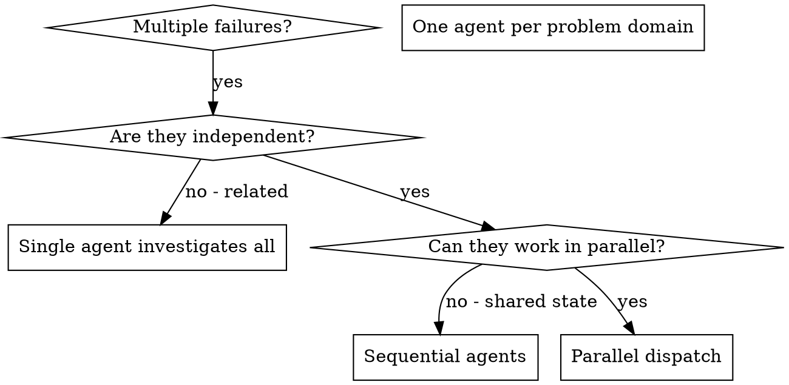

# 병렬 에이전트 디스패칭

## 개요

전문 에이전트에게 격리된 컨텍스트로 작업을 위임합니다. 에이전트의 지시사항과 컨텍스트를 정확하게 구성함으로써 에이전트가 집중력을 유지하고 작업에 성공하도록 보장합니다. 에이전트는 절대로 현재 세션의 컨텍스트나 히스토리를 상속받지 않아야 합니다 - 에이전트에게 필요한 것만 정확히 구성합니다. 이는 또한 조율 작업을 위한 자신의 컨텍스트도 보존합니다.

관련 없는 여러 실패(서로 다른 테스트 파일, 서로 다른 서브시스템, 서로 다른 버그)가 있을 때, 순차적으로 조사하면 시간을 낭비합니다. 각 조사는 독립적이며 병렬로 수행할 수 있습니다.

**핵심 원칙:** 독립적인 문제 영역마다 하나의 에이전트를 디스패치합니다. 동시에 작업하게 합니다.

## 사용 시점



**사용하는 경우:**
- 서로 다른 근본 원인으로 3개 이상의 테스트 파일이 실패할 때
- 여러 서브시스템이 독립적으로 고장났을 때
- 각 문제가 다른 문제의 컨텍스트 없이 이해될 수 있을 때
- 조사 간에 공유 상태가 없을 때

**사용하지 않는 경우:**
- 실패들이 관련되어 있을 때 (하나를 수정하면 다른 것도 수정될 수 있음)
- 전체 시스템 상태를 이해해야 할 때
- 에이전트들이 서로 간섭할 수 있을 때

## 패턴

### 1. 독립적인 영역 식별

실패를 고장난 부분별로 그룹화합니다:
- 파일 A 테스트: 도구 승인 흐름
- 파일 B 테스트: 배치 완료 동작
- 파일 C 테스트: 중단 기능

각 영역은 독립적입니다 - 도구 승인을 수정해도 중단 테스트에 영향을 미치지 않습니다.

### 2. 집중된 에이전트 작업 생성

각 에이전트는 다음을 받습니다:
- **구체적인 범위:** 하나의 테스트 파일 또는 서브시스템
- **명확한 목표:** 이 테스트들을 통과시키기
- **제약 조건:** 다른 코드를 변경하지 않기
- **기대 출력:** 발견하고 수정한 내용의 요약

### 3. 병렬로 디스패치

```typescript
// Claude Code / AI 환경에서
Task("Fix agent-tool-abort.test.ts failures")
Task("Fix batch-completion-behavior.test.ts failures")
Task("Fix tool-approval-race-conditions.test.ts failures")
// 세 작업 모두 동시에 실행
```

### 4. 검토 및 통합

에이전트가 돌아오면:
- 각 요약 읽기
- 수정사항들이 충돌하지 않는지 확인
- 전체 테스트 스위트 실행
- 모든 변경사항 통합

## 에이전트 프롬프트 구조

좋은 에이전트 프롬프트는:
1. **집중됨** - 하나의 명확한 문제 영역
2. **자체 완결적** - 문제를 이해하는 데 필요한 모든 컨텍스트 포함
3. **출력에 대해 구체적** - 에이전트가 무엇을 반환해야 하는가?

```markdown
Fix the 3 failing tests in src/agents/agent-tool-abort.test.ts:

1. "should abort tool with partial output capture" - expects 'interrupted at' in message
2. "should handle mixed completed and aborted tools" - fast tool aborted instead of completed
3. "should properly track pendingToolCount" - expects 3 results but gets 0

These are timing/race condition issues. Your task:

1. Read the test file and understand what each test verifies
2. Identify root cause - timing issues or actual bugs?
3. Fix by:
   - Replacing arbitrary timeouts with event-based waiting
   - Fixing bugs in abort implementation if found
   - Adjusting test expectations if testing changed behavior

Do NOT just increase timeouts - find the real issue.

Return: Summary of what you found and what you fixed.
```

## 흔한 실수

**잘못된 예:** "Fix all the tests" - 에이전트가 길을 잃음
**올바른 예:** "Fix agent-tool-abort.test.ts" - 집중된 범위

**잘못된 예:** "Fix the race condition" - 에이전트가 어디인지 모름
**올바른 예:** 오류 메시지와 테스트 이름을 붙여넣기

**잘못된 예:** 제약 없음 - 에이전트가 모든 것을 리팩토링할 수 있음
**올바른 예:** "Do NOT change production code" 또는 "Fix tests only"

**잘못된 예:** "Fix it" - 무엇이 변경되었는지 알 수 없음
**올바른 예:** "Return summary of root cause and changes"

## 사용하지 말아야 할 때

**관련된 실패:** 하나를 수정하면 다른 것도 수정될 수 있음 - 먼저 함께 조사
**전체 컨텍스트 필요:** 이해하려면 전체 시스템을 봐야 함
**탐색적 디버깅:** 무엇이 고장났는지 아직 모름
**공유 상태:** 에이전트들이 간섭할 수 있음 (같은 파일 편집, 같은 리소스 사용)

## 세션의 실제 예시

**시나리오:** 대규모 리팩토링 후 3개 파일에 걸쳐 6개의 테스트 실패

**실패들:**
- agent-tool-abort.test.ts: 3개 실패 (타이밍 문제)
- batch-completion-behavior.test.ts: 2개 실패 (도구가 실행되지 않음)
- tool-approval-race-conditions.test.ts: 1개 실패 (실행 횟수 = 0)

**결정:** 독립적인 영역 - 중단 로직은 배치 완료와 별개이고, 배치 완료는 경쟁 조건과 별개

**디스패치:**
```
Agent 1 → agent-tool-abort.test.ts 수정
Agent 2 → batch-completion-behavior.test.ts 수정
Agent 3 → tool-approval-race-conditions.test.ts 수정
```

**결과:**
- Agent 1: 타임아웃을 이벤트 기반 대기로 교체
- Agent 2: 이벤트 구조 버그 수정 (threadId가 잘못된 위치에 있었음)
- Agent 3: 비동기 도구 실행 완료를 위한 대기 추가

**통합:** 모든 수정사항이 독립적이며, 충돌 없고, 전체 스위트 통과

**절약된 시간:** 순차적 대비 3개 문제를 병렬로 해결

## 주요 이점

1. **병렬화** - 여러 조사가 동시에 진행
2. **집중** - 각 에이전트가 좁은 범위를 가져 추적할 컨텍스트가 적음
3. **독립성** - 에이전트들이 서로 간섭하지 않음
4. **속도** - 3개 문제를 1개 해결하는 시간에 해결

## 검증

에이전트가 돌아온 후:
1. **각 요약 검토** - 무엇이 변경되었는지 이해
2. **충돌 확인** - 에이전트들이 같은 코드를 편집했는지?
3. **전체 스위트 실행** - 모든 수정사항이 함께 작동하는지 확인
4. **스팟 체크** - 에이전트는 체계적인 오류를 만들 수 있음

## 실제 영향

디버깅 세션에서 (2025-10-03):
- 3개 파일에 걸쳐 6개 실패
- 3개 에이전트를 병렬로 디스패치
- 모든 조사가 동시에 완료
- 모든 수정사항이 성공적으로 통합
- 에이전트 변경사항 간 충돌 없음
