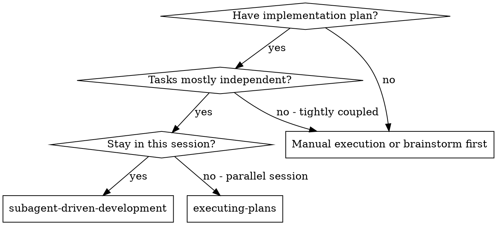
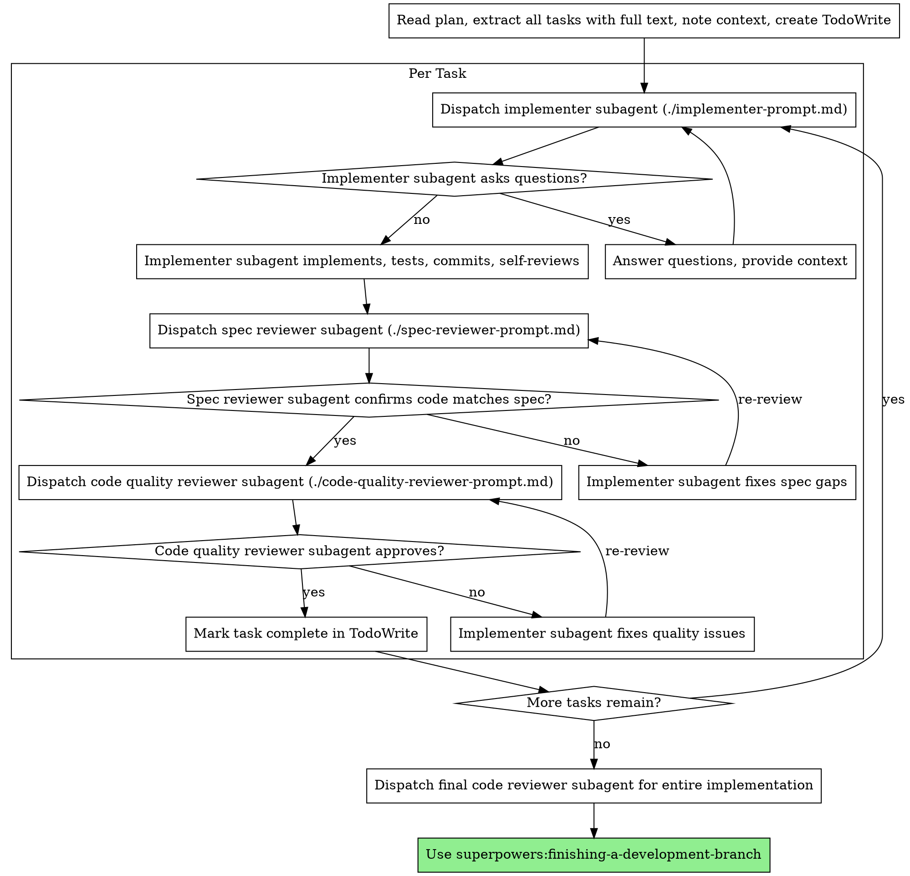

# 서브에이전트 기반 개발

태스크별로 새로운 서브에이전트를 디스패치하여 계획을 실행하며, 각 태스크 완료 후 2단계 리뷰를 수행합니다: 먼저 스펙 준수 리뷰, 그다음 코드 품질 리뷰.

**서브에이전트를 사용하는 이유:** 격리된 컨텍스트를 가진 전문 에이전트에게 태스크를 위임합니다. 지시사항과 컨텍스트를 정밀하게 구성하여 해당 태스크에 집중하고 성공할 수 있도록 합니다. 서브에이전트는 현재 세션의 컨텍스트나 히스토리를 상속하지 않아야 합니다 — 필요한 것만 정확히 구성해서 전달합니다. 이를 통해 자신의 컨텍스트도 조정 작업을 위해 보존됩니다.

**핵심 원칙:** 태스크별 새 서브에이전트 + 2단계 리뷰(스펙 → 품질) = 높은 품질, 빠른 반복

## 사용 시점



**Executing Plans(병렬 세션)와의 차이:**
- 동일 세션 유지 (컨텍스트 전환 없음)
- 태스크별 새 서브에이전트 (컨텍스트 오염 없음)
- 각 태스크 후 2단계 리뷰: 먼저 스펙 준수, 그다음 코드 품질
- 더 빠른 반복 (태스크 간 사람 개입 불필요)

## 프로세스



## 모델 선택

비용을 절약하고 속도를 높이기 위해 각 역할을 처리할 수 있는 가장 가벼운 모델을 사용합니다.

**기계적 구현 태스크** (독립된 함수, 명확한 스펙, 1-2개 파일): 빠르고 저렴한 모델을 사용합니다. 계획이 잘 명세되어 있다면 대부분의 구현 태스크는 기계적입니다.

**통합 및 판단 태스크** (다중 파일 조정, 패턴 매칭, 디버깅): 표준 모델을 사용합니다.

**아키텍처, 설계 및 리뷰 태스크**: 사용 가능한 가장 고성능 모델을 사용합니다.

**태스크 복잡도 판단 기준:**
- 완전한 스펙으로 1-2개 파일 수정 → 저렴한 모델
- 통합 관련 사항이 있는 다중 파일 수정 → 표준 모델
- 설계 판단이나 광범위한 코드베이스 이해 필요 → 가장 고성능 모델

## 구현자 상태 처리

구현자 서브에이전트는 네 가지 상태 중 하나를 보고합니다. 각각 적절히 처리합니다:

**DONE:** 스펙 준수 리뷰로 진행합니다.

**DONE_WITH_CONCERNS:** 구현자가 작업을 완료했지만 의문점을 표시했습니다. 진행하기 전에 우려사항을 읽으세요. 정확성이나 범위에 대한 우려사항이면 리뷰 전에 해결합니다. 관찰 사항(예: "이 파일이 커지고 있다")이면 메모해두고 리뷰로 진행합니다.

**NEEDS_CONTEXT:** 구현자가 제공되지 않은 정보를 필요로 합니다. 누락된 컨텍스트를 제공하고 다시 디스패치합니다.

**BLOCKED:** 구현자가 태스크를 완료할 수 없습니다. 차단 요인을 평가합니다:
1. 컨텍스트 문제인 경우, 더 많은 컨텍스트를 제공하고 같은 모델로 다시 디스패치
2. 더 많은 추론이 필요한 태스크인 경우, 더 고성능 모델로 다시 디스패치
3. 태스크가 너무 큰 경우, 더 작은 조각으로 분할
4. 계획 자체가 잘못된 경우, 사람에게 에스컬레이션

에스컬레이션을 **절대** 무시하거나 변경 없이 같은 모델로 재시도하지 마세요. 구현자가 막혔다고 말했다면 무언가를 변경해야 합니다.

## 프롬프트 템플릿

- `./implementer-prompt.md` - 구현자 서브에이전트 디스패치
- `./spec-reviewer-prompt.md` - 스펙 준수 리뷰어 서브에이전트 디스패치
- `./code-quality-reviewer-prompt.md` - 코드 품질 리뷰어 서브에이전트 디스패치

## 워크플로우 예시

```
You: 이 계획을 실행하기 위해 서브에이전트 기반 개발을 사용하겠습니다.

[계획 파일을 한 번 읽음: docs/superpowers/plans/feature-plan.md]
[5개 태스크 전체를 전문 및 컨텍스트와 함께 추출]
[모든 태스크로 TodoWrite 생성]

태스크 1: Hook 설치 스크립트

[태스크 1 텍스트와 컨텍스트 가져오기 (이미 추출됨)]
[전체 태스크 텍스트 + 컨텍스트와 함께 구현 서브에이전트 디스패치]

구현자: "시작 전에 - hook을 사용자 수준으로 설치해야 하나요, 시스템 수준으로 설치해야 하나요?"

You: "사용자 수준 (~/.config/superpowers/hooks/)"

구현자: "알겠습니다. 지금 구현하겠습니다..."
[이후] 구현자:
  - install-hook 명령어 구현 완료
  - 테스트 추가, 5/5 통과
  - 셀프 리뷰: --force 플래그를 빠뜨린 것을 발견하여 추가
  - 커밋 완료

[스펙 준수 리뷰어 디스패치]
스펙 리뷰어: ✅ 스펙 준수 - 모든 요구사항 충족, 추가 사항 없음

[git SHA 확인, 코드 품질 리뷰어 디스패치]
코드 리뷰어: 강점: 좋은 테스트 커버리지, 깔끔함. 이슈: 없음. 승인.

[태스크 1 완료 표시]

태스크 2: 복구 모드

[태스크 2 텍스트와 컨텍스트 가져오기 (이미 추출됨)]
[전체 태스크 텍스트 + 컨텍스트와 함께 구현 서브에이전트 디스패치]

구현자: [질문 없음, 진행]
구현자:
  - verify/repair 모드 추가
  - 8/8 테스트 통과
  - 셀프 리뷰: 문제 없음
  - 커밋 완료

[스펙 준수 리뷰어 디스패치]
스펙 리뷰어: ❌ 이슈:
  - 누락: 진행 상황 보고 (스펙에 "100개 항목마다 보고"라고 명시됨)
  - 추가: --json 플래그 추가 (요청되지 않음)

[구현자가 이슈 수정]
구현자: --json 플래그 제거, 진행 상황 보고 추가

[스펙 리뷰어 재검토]
스펙 리뷰어: ✅ 이제 스펙 준수

[코드 품질 리뷰어 디스패치]
코드 리뷰어: 강점: 견고함. 이슈 (중요): 매직 넘버 (100)

[구현자 수정]
구현자: PROGRESS_INTERVAL 상수 추출

[코드 리뷰어 재검토]
코드 리뷰어: ✅ 승인

[태스크 2 완료 표시]

...

[모든 태스크 완료 후]
[최종 코드 리뷰어 디스패치]
최종 리뷰어: 모든 요구사항 충족, 머지 준비 완료

완료!
```

## 장점

**수동 실행 대비:**
- 서브에이전트가 자연스럽게 TDD를 따름
- 태스크별 새로운 컨텍스트 (혼동 없음)
- 병렬 안전 (서브에이전트 간 간섭 없음)
- 서브에이전트가 질문 가능 (작업 전과 중 모두)

**Executing Plans 대비:**
- 동일 세션 (핸드오프 없음)
- 지속적 진행 (대기 없음)
- 리뷰 체크포인트 자동화

**효율성 향상:**
- 파일 읽기 오버헤드 없음 (컨트롤러가 전문 제공)
- 컨트롤러가 필요한 컨텍스트를 정확히 선별
- 서브에이전트가 사전에 완전한 정보 수신
- 질문이 작업 시작 전에 표면화됨 (작업 후가 아님)

**품질 게이트:**
- 셀프 리뷰가 핸드오프 전 이슈 포착
- 2단계 리뷰: 스펙 준수, 그다음 코드 품질
- 리뷰 루프가 수정이 실제로 작동하는지 보장
- 스펙 준수가 과다/과소 구현 방지
- 코드 품질이 구현의 완성도 보장

**비용:**
- 더 많은 서브에이전트 호출 (태스크당 구현자 + 리뷰어 2명)
- 컨트롤러의 준비 작업 증가 (모든 태스크를 사전에 추출)
- 리뷰 루프로 반복 횟수 증가
- 하지만 이슈를 조기에 발견 (나중에 디버깅하는 것보다 저렴)

## 위험 신호

**절대 하지 말 것:**
- 명시적인 사용자 동의 없이 main/master 브랜치에서 구현 시작
- 리뷰 건너뛰기 (스펙 준수 또는 코드 품질)
- 미수정 이슈가 있는 상태로 진행
- 여러 구현 서브에이전트를 병렬로 디스패치 (충돌 발생)
- 서브에이전트가 계획 파일을 읽게 하기 (대신 전문을 제공)
- 장면 설정 컨텍스트 건너뛰기 (서브에이전트가 태스크의 위치를 이해해야 함)
- 서브에이전트 질문 무시 (진행하기 전에 답변)
- 스펙 준수에서 "거의 맞음"을 수용 (스펙 리뷰어가 이슈를 발견했다면 = 완료되지 않음)
- 리뷰 루프 건너뛰기 (리뷰어가 이슈 발견 = 구현자 수정 = 다시 리뷰)
- 구현자의 셀프 리뷰가 실제 리뷰를 대체하게 하기 (둘 다 필요)
- **스펙 준수가 통과되기 전에 코드 품질 리뷰 시작** (순서가 잘못됨)
- 어느 리뷰든 미해결 이슈가 있는 상태에서 다음 태스크로 이동

**서브에이전트가 질문하는 경우:**
- 명확하고 완전하게 답변
- 필요하면 추가 컨텍스트 제공
- 서둘러 구현하도록 재촉하지 않기

**리뷰어가 이슈를 발견한 경우:**
- 구현자 (동일 서브에이전트)가 수정
- 리뷰어가 다시 리뷰
- 승인될 때까지 반복
- 재리뷰를 건너뛰지 않기

**서브에이전트가 태스크에 실패한 경우:**
- 구체적인 지시사항과 함께 수정 서브에이전트 디스패치
- 직접 수동으로 수정하지 않기 (컨텍스트 오염)

## 통합

**필수 워크플로우 스킬:**
- **superpowers:using-git-worktrees** - 필수: 시작 전 격리된 작업 공간 설정
- **superpowers:writing-plans** - 이 스킬이 실행할 계획을 작성
- **superpowers:requesting-code-review** - 리뷰어 서브에이전트용 코드 리뷰 템플릿
- **superpowers:finishing-a-development-branch** - 모든 태스크 완료 후 개발 마무리

**서브에이전트가 사용해야 할 것:**
- **superpowers:test-driven-development** - 서브에이전트가 각 태스크에서 TDD를 따름

**대안 워크플로우:**
- **superpowers:executing-plans** - 동일 세션 대신 병렬 세션 실행 시 사용
