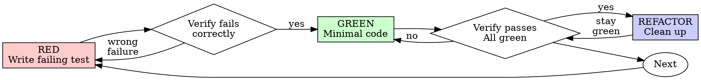

# 테스트 주도 개발 (TDD)

## 개요

테스트를 먼저 작성하라. 실패하는 것을 확인하라. 통과시키는 최소한의 코드를 작성하라.

**핵심 원칙:** 테스트가 실패하는 것을 직접 확인하지 않았다면, 그 테스트가 올바른 것을 검증하는지 알 수 없다.

**규칙의 문구를 위반하는 것은 규칙의 정신을 위반하는 것이다.**

## 사용 시점

**항상:**
- 새 기능
- 버그 수정
- 리팩토링
- 동작 변경

**예외 (인간 파트너에게 확인):**
- 일회용 프로토타입
- 생성된 코드
- 설정 파일

"이번 한 번만 TDD를 건너뛸까?" 생각이 들었다면? 멈춰라. 그건 합리화다.

## 철의 법칙

```
실패하는 테스트 없이는 프로덕션 코드를 작성하지 않는다
```

테스트 전에 코드를 작성했는가? 삭제하라. 처음부터 다시 시작하라.

**예외 없음:**
- "참고용"으로 남겨두지 마라
- 테스트를 작성하면서 "적용"하지 마라
- 보지도 마라
- 삭제는 삭제를 의미한다

테스트로부터 새로 구현하라. 끝.

## Red-Green-Refactor



### RED - 실패하는 테스트 작성

무엇이 일어나야 하는지를 보여주는 최소한의 테스트 하나를 작성하라.

<Good>
```typescript
test('retries failed operations 3 times', async () => {
  let attempts = 0;
  const operation = () => {
    attempts++;
    if (attempts < 3) throw new Error('fail');
    return 'success';
  };

  const result = await retryOperation(operation);

  expect(result).toBe('success');
  expect(attempts).toBe(3);
});
```
명확한 이름, 실제 동작을 테스트, 한 가지만 테스트
</Good>

<Bad>
```typescript
test('retry works', async () => {
  const mock = jest.fn()
    .mockRejectedValueOnce(new Error())
    .mockRejectedValueOnce(new Error())
    .mockResolvedValueOnce('success');
  await retryOperation(mock);
  expect(mock).toHaveBeenCalledTimes(3);
});
```
모호한 이름, 코드가 아닌 mock을 테스트
</Bad>

**요구사항:**
- 하나의 동작
- 명확한 이름
- 실제 코드 (불가피한 경우가 아니면 mock 금지)

### RED 검증 - 실패를 확인하라

**필수. 절대 생략하지 마라.**

```bash
npm test path/to/test.test.ts
```

확인 사항:
- 테스트가 실패한다 (에러가 아님)
- 실패 메시지가 예상한 것과 같다
- 기능이 없어서 실패한다 (오타 때문이 아님)

**테스트가 통과했는가?** 기존 동작을 테스트하고 있는 것이다. 테스트를 수정하라.

**테스트에서 에러가 발생했는가?** 에러를 수정하고, 올바르게 실패할 때까지 다시 실행하라.

### GREEN - 최소한의 코드

테스트를 통과시키는 가장 간단한 코드를 작성하라.

<Good>
```typescript
async function retryOperation<T>(fn: () => Promise<T>): Promise<T> {
  for (let i = 0; i < 3; i++) {
    try {
      return await fn();
    } catch (e) {
      if (i === 2) throw e;
    }
  }
  throw new Error('unreachable');
}
```
통과시키기에 딱 충분한 코드
</Good>

<Bad>
```typescript
async function retryOperation<T>(
  fn: () => Promise<T>,
  options?: {
    maxRetries?: number;
    backoff?: 'linear' | 'exponential';
    onRetry?: (attempt: number) => void;
  }
): Promise<T> {
  // YAGNI
}
```
과도한 설계
</Bad>

기능을 추가하거나, 다른 코드를 리팩토링하거나, 테스트 범위를 넘어서 "개선"하지 마라.

### GREEN 검증 - 통과를 확인하라

**필수.**

```bash
npm test path/to/test.test.ts
```

확인 사항:
- 테스트가 통과한다
- 다른 테스트도 여전히 통과한다
- 출력이 깨끗하다 (에러, 경고 없음)

**테스트가 실패했는가?** 코드를 수정하라, 테스트를 수정하지 마라.

**다른 테스트가 실패했는가?** 지금 바로 수정하라.

### REFACTOR - 정리

GREEN 이후에만:
- 중복 제거
- 이름 개선
- 헬퍼 추출

테스트를 GREEN으로 유지하라. 동작을 추가하지 마라.

### 반복

다음 기능을 위한 다음 실패 테스트로 이동하라.

## 좋은 테스트

| 품질 | 좋음 | 나쁨 |
|------|------|------|
| **최소한** | 한 가지만. 이름에 "and"가 있으면? 분리하라. | `test('validates email and domain and whitespace')` |
| **명확함** | 이름이 동작을 설명한다 | `test('test1')` |
| **의도를 보여줌** | 원하는 API를 시연한다 | 코드가 무엇을 해야 하는지 불분명하게 만든다 |

## 순서가 중요한 이유

**"나중에 테스트를 작성해서 동작을 검증하겠다"**

코드 이후에 작성된 테스트는 즉시 통과한다. 즉시 통과하는 것은 아무것도 증명하지 못한다:
- 잘못된 것을 테스트할 수 있다
- 동작이 아닌 구현을 테스트할 수 있다
- 잊어버린 엣지 케이스를 놓칠 수 있다
- 테스트가 버그를 잡는 것을 본 적이 없다

테스트를 먼저 작성하면 테스트가 실패하는 것을 확인하게 되어, 실제로 무언가를 테스트하고 있음을 증명한다.

**"이미 모든 엣지 케이스를 수동으로 테스트했다"**

수동 테스트는 즉흥적이다. 모든 것을 테스트했다고 생각하지만:
- 무엇을 테스트했는지 기록이 없다
- 코드가 변경되면 다시 실행할 수 없다
- 압박 속에서 케이스를 잊기 쉽다
- "해봤더니 동작했다" ≠ 포괄적 테스트

자동화된 테스트는 체계적이다. 매번 같은 방식으로 실행된다.

**"X시간의 작업을 삭제하는 것은 낭비다"**

매몰 비용의 오류다. 시간은 이미 지나갔다. 지금의 선택:
- 삭제하고 TDD로 다시 작성한다 (X시간 더 소요, 높은 신뢰도)
- 유지하고 나중에 테스트를 추가한다 (30분, 낮은 신뢰도, 버그 가능성 높음)

"낭비"는 신뢰할 수 없는 코드를 유지하는 것이다. 제대로 된 테스트 없이 동작하는 코드는 기술 부채다.

**"TDD는 독단적이다, 실용적이란 것은 적응하는 것이다"**

TDD가 실용적이다:
- 커밋 전에 버그를 찾는다 (나중에 디버깅하는 것보다 빠르다)
- 회귀를 방지한다 (테스트가 즉시 깨진 것을 잡는다)
- 동작을 문서화한다 (테스트가 코드 사용법을 보여준다)
- 리팩토링을 가능하게 한다 (자유롭게 변경하고, 테스트가 깨진 것을 잡는다)

"실용적" 지름길 = 프로덕션에서 디버깅 = 더 느리다.

**"나중에 테스트해도 같은 목표를 달성한다 - 의식이 아니라 정신이 중요하다"**

아니다. 나중에 작성한 테스트는 "이것이 무엇을 하는가?"에 답한다. 먼저 작성한 테스트는 "이것이 무엇을 해야 하는가?"에 답한다.

나중에 작성한 테스트는 구현에 편향된다. 만든 것을 테스트하지, 요구되는 것을 테스트하지 않는다. 기억나는 엣지 케이스를 검증하지, 발견된 엣지 케이스를 검증하지 않는다.

먼저 작성한 테스트는 구현 전에 엣지 케이스 발견을 강제한다. 나중에 작성한 테스트는 모든 것을 기억했는지 검증한다 (기억하지 못했을 것이다).

나중에 30분 동안 테스트 작성 ≠ TDD. 커버리지는 얻지만, 테스트가 작동한다는 증명은 잃는다.

## 일반적인 합리화

| 변명 | 현실 |
|------|------|
| "테스트하기엔 너무 간단하다" | 간단한 코드도 깨진다. 테스트는 30초면 된다. |
| "나중에 테스트하겠다" | 즉시 통과하는 테스트는 아무것도 증명하지 못한다. |
| "나중에 테스트해도 같은 목표를 달성한다" | 나중 테스트 = "이것이 무엇을 하는가?" 먼저 테스트 = "이것이 무엇을 해야 하는가?" |
| "이미 수동으로 테스트했다" | 즉흥적 ≠ 체계적. 기록 없음, 재실행 불가. |
| "X시간을 삭제하는 것은 낭비다" | 매몰 비용의 오류. 검증되지 않은 코드를 유지하는 것이 기술 부채다. |
| "참고용으로 유지하고, 테스트를 먼저 작성하겠다" | 적용하게 될 것이다. 그것은 나중에 테스트하는 것이다. 삭제는 삭제다. |
| "먼저 탐색이 필요하다" | 좋다. 탐색을 버리고, TDD로 시작하라. |
| "테스트가 어렵다 = 설계가 불명확하다" | 테스트의 말을 들어라. 테스트하기 어렵다 = 사용하기 어렵다. |
| "TDD가 나를 느리게 할 것이다" | TDD가 디버깅보다 빠르다. 실용적 = 테스트 먼저. |
| "수동 테스트가 더 빠르다" | 수동 테스트는 엣지 케이스를 증명하지 못한다. 변경할 때마다 다시 테스트해야 한다. |
| "기존 코드에 테스트가 없다" | 개선하고 있는 것이다. 기존 코드에 대한 테스트를 추가하라. |

## 위험 신호 - 멈추고 처음부터 다시 시작하라

- 테스트 전에 코드 작성
- 구현 후 테스트
- 테스트가 즉시 통과
- 테스트가 왜 실패했는지 설명할 수 없음
- "나중에" 추가된 테스트
- "이번 한 번만"이라고 합리화
- "이미 수동으로 테스트했다"
- "나중에 테스트해도 같은 목적을 달성한다"
- "의식이 아니라 정신이 중요하다"
- "참고용으로 유지" 또는 "기존 코드를 적용"
- "이미 X시간을 투자했는데, 삭제하는 것은 낭비다"
- "TDD는 독단적이다, 나는 실용적이다"
- "이건 다른 경우인데..."

**이 모든 것은 다음을 의미한다: 코드를 삭제하라. TDD로 처음부터 다시 시작하라.**

## 예시: 버그 수정

**버그:** 빈 이메일이 허용됨

**RED**
```typescript
test('rejects empty email', async () => {
  const result = await submitForm({ email: '' });
  expect(result.error).toBe('Email required');
});
```

**RED 검증**
```bash
$ npm test
FAIL: expected 'Email required', got undefined
```

**GREEN**
```typescript
function submitForm(data: FormData) {
  if (!data.email?.trim()) {
    return { error: 'Email required' };
  }
  // ...
}
```

**GREEN 검증**
```bash
$ npm test
PASS
```

**REFACTOR**
필요하다면 여러 필드에 대한 검증을 추출하라.

## 검증 체크리스트

작업 완료로 표시하기 전:

- [ ] 모든 새 함수/메서드에 테스트가 있다
- [ ] 구현 전에 각 테스트가 실패하는 것을 확인했다
- [ ] 각 테스트가 예상한 이유로 실패했다 (기능 미구현, 오타가 아님)
- [ ] 각 테스트를 통과시키기 위한 최소한의 코드를 작성했다
- [ ] 모든 테스트가 통과한다
- [ ] 출력이 깨끗하다 (에러, 경고 없음)
- [ ] 테스트가 실제 코드를 사용한다 (불가피한 경우에만 mock)
- [ ] 엣지 케이스와 에러가 다뤄졌다

모든 항목을 체크할 수 없는가? TDD를 건너뛴 것이다. 처음부터 다시 시작하라.

## 막혔을 때

| 문제 | 해결책 |
|------|--------|
| 테스트 방법을 모르겠다 | 원하는 API를 작성하라. 단언문을 먼저 작성하라. 인간 파트너에게 물어보라. |
| 테스트가 너무 복잡하다 | 설계가 너무 복잡하다. 인터페이스를 단순화하라. |
| 모든 것을 mock해야 한다 | 코드의 결합도가 너무 높다. 의존성 주입을 사용하라. |
| 테스트 설정이 방대하다 | 헬퍼를 추출하라. 여전히 복잡한가? 설계를 단순화하라. |

## 디버깅 통합

버그를 발견했는가? 이를 재현하는 실패 테스트를 작성하라. TDD 사이클을 따르라. 테스트가 수정을 증명하고 회귀를 방지한다.

테스트 없이 절대 버그를 수정하지 마라.

## 테스트 안티패턴

mock이나 테스트 유틸리티를 추가할 때, @testing-anti-patterns.md를 읽고 일반적인 함정을 피하라:
- 실제 동작 대신 mock 동작을 테스트
- 프로덕션 클래스에 테스트 전용 메서드 추가
- 의존성을 이해하지 않고 mock 사용

## 최종 규칙

```
프로덕션 코드 → 테스트가 존재하고 먼저 실패했어야 한다
그렇지 않으면 → TDD가 아니다
```

인간 파트너의 허락 없이는 예외 없다.
