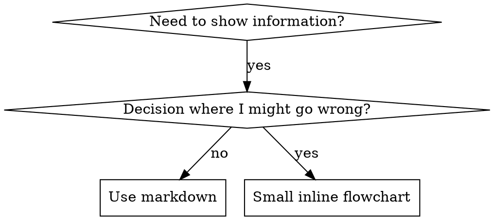

# 스킬 작성하기

## 개요

**스킬 작성은 프로세스 문서에 적용된 테스트 주도 개발(TDD)입니다.**

**개인 스킬은 에이전트별 디렉토리에 저장됩니다 (Claude Code의 경우 `~/.claude/skills`, Codex의 경우 `~/.agents/skills/`)**

테스트 케이스(서브에이전트를 사용한 압박 시나리오)를 작성하고, 실패를 확인하고(기준 행동), 스킬(문서)을 작성하고, 테스트가 통과하는지 확인하고(에이전트 준수), 리팩토링(허점 보완)합니다.

**핵심 원칙:** 스킬 없이 에이전트가 실패하는 것을 직접 확인하지 않았다면, 스킬이 올바른 것을 가르치는지 알 수 없습니다.

**필수 배경지식:** 이 스킬을 사용하기 전에 반드시 superpowers:test-driven-development를 이해해야 합니다. 해당 스킬은 기본적인 RED-GREEN-REFACTOR 사이클을 정의합니다. 이 스킬은 TDD를 문서에 적용합니다.

**공식 가이드:** Anthropic의 공식 스킬 작성 모범 사례는 anthropic-best-practices.md를 참조하세요. 이 문서는 이 스킬의 TDD 중심 접근 방식을 보완하는 추가 패턴과 가이드라인을 제공합니다.

## 스킬이란?

**스킬**은 검증된 기법, 패턴 또는 도구에 대한 참조 가이드입니다. 스킬은 미래의 Claude 인스턴스가 효과적인 접근 방식을 찾고 적용할 수 있도록 돕습니다.

**스킬의 본질:** 재사용 가능한 기법, 패턴, 도구, 참조 가이드

**스킬이 아닌 것:** 한 번 문제를 해결한 방법에 대한 서술

## TDD 매핑 - 스킬 생성

| TDD 개념 | 스킬 생성 |
|-------------|----------------|
| **테스트 케이스** | 서브에이전트를 사용한 압박 시나리오 |
| **프로덕션 코드** | 스킬 문서 (SKILL.md) |
| **테스트 실패 (RED)** | 스킬 없이 에이전트가 규칙 위반 (기준선) |
| **테스트 통과 (GREEN)** | 스킬이 있으면 에이전트가 준수 |
| **리팩토링** | 준수를 유지하면서 허점 보완 |
| **테스트를 먼저 작성** | 스킬 작성 전에 기준선 시나리오 실행 |
| **실패 확인** | 에이전트가 사용하는 정확한 합리화 기록 |
| **최소한의 코드** | 해당 위반 사항을 다루는 스킬 작성 |
| **통과 확인** | 에이전트가 이제 준수하는지 검증 |
| **리팩토링 사이클** | 새로운 합리화 발견 → 보완 → 재검증 |

전체 스킬 생성 프로세스는 RED-GREEN-REFACTOR를 따릅니다.

## 스킬을 만들어야 할 때

**만들어야 할 때:**
- 기법이 직관적으로 명확하지 않았을 때
- 프로젝트 간에 다시 참조할 만할 때
- 패턴이 광범위하게 적용될 때 (프로젝트 특정이 아닌)
- 다른 사람에게도 도움이 될 때

**만들지 않아야 할 때:**
- 일회성 솔루션
- 다른 곳에 잘 문서화된 표준 관행
- 프로젝트 특정 규칙 (CLAUDE.md에 작성)
- 기계적 제약 (정규식/검증으로 강제할 수 있다면 자동화하세요 — 문서는 판단이 필요한 경우에 사용)

## 스킬 유형

### Technique (기법)
따라야 할 구체적인 단계가 있는 방법 (condition-based-waiting, root-cause-tracing)

### Pattern (패턴)
문제를 생각하는 방식 (flatten-with-flags, test-invariants)

### Reference (참조)
API 문서, 문법 가이드, 도구 문서 (office docs)

## 디렉토리 구조


```
skills/
  skill-name/
    SKILL.md              # 메인 참조 (필수)
    supporting-file.*     # 필요한 경우에만
```

**플랫 네임스페이스** - 모든 스킬이 하나의 검색 가능한 네임스페이스에 존재

**별도 파일이 필요한 경우:**
1. **대용량 참조** (100줄 이상) - API 문서, 종합적인 문법
2. **재사용 가능한 도구** - 스크립트, 유틸리티, 템플릿

**인라인으로 유지할 것:**
- 원칙과 개념
- 코드 패턴 (50줄 미만)
- 나머지 전부

## SKILL.md 구조

**프론트매터 (YAML):**
- 두 개의 필수 필드: `name`과 `description` (지원되는 모든 필드는 [agentskills.io/specification](https://agentskills.io/specification) 참조)
- 총 최대 1024자
- `name`: 문자, 숫자, 하이픈만 사용 (괄호, 특수문자 불가)
- `description`: 3인칭으로 작성, 사용 시기만 기술 (무엇을 하는지가 아닌)
  - "Use when..."으로 시작하여 트리거 조건에 집중
  - 구체적인 증상, 상황, 맥락 포함
  - **절대로 스킬의 프로세스나 워크플로우를 요약하지 말 것** (이유는 CSO 섹션 참조)
  - 가능하면 500자 이내로 유지

```markdown
---
name: Skill-Name-With-Hyphens
description: Use when [specific triggering conditions and symptoms]
---

# 스킬 이름

## 개요
이것은 무엇인가? 핵심 원칙을 1-2 문장으로.

## 사용 시기
[결정이 명확하지 않은 경우 작은 인라인 플로우차트]

증상과 사용 사례를 불릿 리스트로
사용하지 않아야 할 때

## 핵심 패턴 (기법/패턴용)
전/후 코드 비교

## 빠른 참조
일반적인 작업을 스캔하기 위한 테이블 또는 불릿

## 구현
간단한 패턴은 인라인 코드
대용량 참조나 재사용 가능한 도구는 파일 링크

## 흔한 실수
무엇이 잘못될 수 있는지 + 해결 방법

## 실제 영향 (선택사항)
구체적인 결과
```


## Claude 검색 최적화 (CSO)

**발견 가능성에 매우 중요:** 미래의 Claude가 당신의 스킬을 찾을 수 있어야 합니다

### 1. 풍부한 Description 필드

**목적:** Claude는 주어진 작업에 어떤 스킬을 로드할지 결정하기 위해 description을 읽습니다. "지금 이 스킬을 읽어야 하나?"라는 질문에 답할 수 있도록 작성하세요.

**형식:** "Use when..."으로 시작하여 트리거 조건에 집중

**중요: Description = 사용 시기, 스킬이 하는 것이 아님**

description은 트리거 조건만 기술해야 합니다. description에 스킬의 프로세스나 워크플로우를 요약하지 마세요.

**이것이 중요한 이유:** 테스트 결과, description이 스킬의 워크플로우를 요약하면 Claude가 전체 스킬 내용을 읽지 않고 description을 따를 수 있다는 것이 밝혀졌습니다. "작업 간 코드 리뷰"라는 description은 Claude가 하나의 리뷰만 수행하게 했는데, 스킬의 플로우차트는 명확히 두 번의 리뷰(사양 준수 후 코드 품질)를 보여주고 있었습니다.

description을 "Use when executing implementation plans with independent tasks"(워크플로우 요약 없음)로 변경했을 때, Claude는 올바르게 플로우차트를 읽고 2단계 리뷰 프로세스를 따랐습니다.

**함정:** 워크플로우를 요약하는 description은 Claude가 취할 지름길을 만듭니다. 스킬 본문은 Claude가 건너뛰는 문서가 됩니다.

```yaml
# ❌ 나쁨: 워크플로우 요약 - Claude가 스킬을 읽지 않고 이것을 따를 수 있음
description: Use when executing plans - dispatches subagent per task with code review between tasks

# ❌ 나쁨: 프로세스 세부사항이 너무 많음
description: Use for TDD - write test first, watch it fail, write minimal code, refactor

# ✅ 좋음: 트리거 조건만, 워크플로우 요약 없음
description: Use when executing implementation plans with independent tasks in the current session

# ✅ 좋음: 트리거 조건만
description: Use when implementing any feature or bugfix, before writing implementation code
```

**내용:**
- 이 스킬이 적용됨을 알려주는 구체적인 트리거, 증상, 상황 사용
- *문제*를 기술 (경합 조건, 일관성 없는 동작), *언어별 증상*이 아님 (setTimeout, sleep)
- 스킬 자체가 기술 특정이 아닌 한 트리거를 기술 중립적으로 유지
- 스킬이 기술 특정이라면 트리거에서 명확하게 표시
- 3인칭으로 작성 (시스템 프롬프트에 주입됨)
- **절대로 스킬의 프로세스나 워크플로우를 요약하지 말 것**

```yaml
# ❌ 나쁨: 너무 추상적, 모호함, 사용 시기 미포함
description: For async testing

# ❌ 나쁨: 1인칭
description: I can help you with async tests when they're flaky

# ❌ 나쁨: 기술을 언급하지만 스킬이 그것에 특정되지 않음
description: Use when tests use setTimeout/sleep and are flaky

# ✅ 좋음: "Use when"으로 시작, 문제 기술, 워크플로우 없음
description: Use when tests have race conditions, timing dependencies, or pass/fail inconsistently

# ✅ 좋음: 기술 특정 스킬에 명시적 트리거
description: Use when using React Router and handling authentication redirects
```

### 2. 키워드 커버리지

Claude가 검색할 단어를 사용하세요:
- 에러 메시지: "Hook timed out", "ENOTEMPTY", "race condition"
- 증상: "flaky", "hanging", "zombie", "pollution"
- 동의어: "timeout/hang/freeze", "cleanup/teardown/afterEach"
- 도구: 실제 명령어, 라이브러리 이름, 파일 타입

### 3. 설명적 이름 짓기

**능동태, 동사 우선 사용:**
- ✅ `creating-skills` (`skill-creation` 아님)
- ✅ `condition-based-waiting` (`async-test-helpers` 아님)

### 4. 토큰 효율성 (중요)

**문제:** getting-started 및 자주 참조되는 스킬은 모든 대화에 로드됩니다. 모든 토큰이 중요합니다.

**목표 단어 수:**
- getting-started 워크플로우: 각 150단어 미만
- 자주 로드되는 스킬: 총 200단어 미만
- 기타 스킬: 500단어 미만 (여전히 간결하게)

**기법:**

**세부사항을 도구 도움말로 이동:**
```bash
# ❌ 나쁨: SKILL.md에 모든 플래그 문서화
search-conversations supports --text, --both, --after DATE, --before DATE, --limit N

# ✅ 좋음: --help 참조
search-conversations supports multiple modes and filters. Run --help for details.
```

**상호 참조 사용:**
```markdown
# ❌ 나쁨: 워크플로우 세부사항 반복
When searching, dispatch subagent with template...
[20줄의 반복 지시사항]

# ✅ 좋음: 다른 스킬 참조
Always use subagents (50-100x context savings). REQUIRED: Use [other-skill-name] for workflow.
```

**예시 압축:**
```markdown
# ❌ 나쁨: 장황한 예시 (42단어)
your human partner: "How did we handle authentication errors in React Router before?"
You: I'll search past conversations for React Router authentication patterns.
[Dispatch subagent with search query: "React Router authentication error handling 401"]

# ✅ 좋음: 최소한의 예시 (20단어)
Partner: "How did we handle auth errors in React Router?"
You: Searching...
[Dispatch subagent → synthesis]
```

**중복 제거:**
- 상호 참조된 스킬에 있는 내용 반복하지 않기
- 명령어에서 명확한 것 설명하지 않기
- 같은 패턴의 여러 예시 포함하지 않기

**검증:**
```bash
wc -w skills/path/SKILL.md
# getting-started 워크플로우: 각 150 미만 목표
# 기타 자주 로드되는 것: 총 200 미만 목표
```

**하는 일이나 핵심 통찰로 이름 짓기:**
- ✅ `condition-based-waiting` > `async-test-helpers`
- ✅ `using-skills` (`skill-usage` 아님)
- ✅ `flatten-with-flags` > `data-structure-refactoring`
- ✅ `root-cause-tracing` > `debugging-techniques`

**동명사(-ing)는 프로세스에 잘 맞음:**
- `creating-skills`, `testing-skills`, `debugging-with-logs`
- 능동적이며, 취하는 행동을 설명

### 4. 다른 스킬 상호 참조

**다른 스킬을 참조하는 문서를 작성할 때:**

스킬 이름만 사용하고, 명시적 필수 표시를 추가하세요:
- ✅ 좋음: `**REQUIRED SUB-SKILL:** Use superpowers:test-driven-development`
- ✅ 좋음: `**REQUIRED BACKGROUND:** You MUST understand superpowers:systematic-debugging`
- ❌ 나쁨: `See skills/testing/test-driven-development` (필수인지 불명확)
- ❌ 나쁨: `@skills/testing/test-driven-development/SKILL.md` (강제 로드, 컨텍스트 소비)

**@ 링크를 사용하지 않는 이유:** `@` 문법은 파일을 즉시 강제 로드하여, 필요하기 전에 200k+ 컨텍스트를 소비합니다.

## 플로우차트 사용



**플로우차트는 다음에만 사용:**
- 명확하지 않은 결정 포인트
- 너무 일찍 멈출 수 있는 프로세스 루프
- "A vs B 사용 시기" 결정

**플로우차트를 사용하지 않아야 할 곳:**
- 참조 자료 → 테이블, 리스트
- 코드 예시 → 마크다운 블록
- 선형 지시사항 → 번호 매긴 목록
- 의미 없는 레이블 (step1, helper2)

graphviz 스타일 규칙은 @graphviz-conventions.dot를 참조하세요.

**파트너를 위한 시각화:** 이 디렉토리의 `render-graphs.js`를 사용하여 스킬의 플로우차트를 SVG로 렌더링할 수 있습니다:
```bash
./render-graphs.js ../some-skill           # 각 다이어그램을 개별적으로
./render-graphs.js ../some-skill --combine # 모든 다이어그램을 하나의 SVG로
```

## 코드 예시

**하나의 훌륭한 예시가 여러 평범한 예시보다 낫습니다**

가장 관련성 높은 언어를 선택하세요:
- 테스팅 기법 → TypeScript/JavaScript
- 시스템 디버깅 → Shell/Python
- 데이터 처리 → Python

**좋은 예시:**
- 완전하고 실행 가능
- 왜인지 설명하는 주석이 잘 달림
- 실제 시나리오에서 가져옴
- 패턴을 명확히 보여줌
- 적용할 준비가 됨 (일반 템플릿이 아님)

**하지 말 것:**
- 5개 이상의 언어로 구현
- 빈칸 채우기 템플릿 생성
- 인위적인 예시 작성

Claude는 포팅을 잘합니다 - 하나의 훌륭한 예시면 충분합니다.

## 파일 조직

### 자체 포함 스킬
```
defense-in-depth/
  SKILL.md    # 모든 것이 인라인
```
언제: 모든 내용이 들어가고, 대용량 참조가 필요 없을 때

### 재사용 가능한 도구가 있는 스킬
```
condition-based-waiting/
  SKILL.md    # 개요 + 패턴
  example.ts  # 적용할 수 있는 동작하는 헬퍼
```
언제: 도구가 서술이 아닌 재사용 가능한 코드일 때

### 대용량 참조가 있는 스킬
```
pptx/
  SKILL.md       # 개요 + 워크플로우
  pptxgenjs.md   # 600줄 API 참조
  ooxml.md       # 500줄 XML 구조
  scripts/       # 실행 가능한 도구
```
언제: 참조 자료가 인라인으로 넣기엔 너무 클 때

## 철의 법칙 (TDD와 동일)

```
실패하는 테스트 없이는 스킬도 없다
```

이것은 새 스킬과 기존 스킬 편집 모두에 적용됩니다.

테스트 전에 스킬을 작성했나요? 삭제하세요. 처음부터 다시 시작하세요.
테스트 없이 스킬을 편집했나요? 같은 위반입니다.

**예외 없음:**
- "간단한 추가"에 대해서도 아님
- "섹션 하나 추가"에 대해서도 아님
- "문서 업데이트"에 대해서도 아님
- 테스트하지 않은 변경을 "참조"로 보관하지 말 것
- 테스트를 실행하면서 "적용"하지 말 것
- 삭제란 삭제를 의미함

**필수 배경지식:** superpowers:test-driven-development 스킬이 이것이 왜 중요한지 설명합니다. 같은 원칙이 문서에도 적용됩니다.

## 모든 스킬 유형 테스트

스킬 유형마다 다른 테스트 접근 방식이 필요합니다:

### 규율 강제 스킬 (규칙/요구사항)

**예시:** TDD, verification-before-completion, designing-before-coding

**테스트 방법:**
- 학술적 질문: 규칙을 이해하는가?
- 압박 시나리오: 스트레스 하에서 준수하는가?
- 복합 압박: 시간 + 매몰 비용 + 피로
- 합리화를 식별하고 명시적 대응 추가

**성공 기준:** 최대 압박 하에서 에이전트가 규칙을 따름

### 기법 스킬 (사용 가이드)

**예시:** condition-based-waiting, root-cause-tracing, defensive-programming

**테스트 방법:**
- 적용 시나리오: 기법을 올바르게 적용할 수 있는가?
- 변형 시나리오: 엣지 케이스를 처리하는가?
- 누락 정보 테스트: 지시사항에 빈틈이 있는가?

**성공 기준:** 에이전트가 새로운 시나리오에 기법을 성공적으로 적용

### 패턴 스킬 (멘탈 모델)

**예시:** reducing-complexity, information-hiding 개념

**테스트 방법:**
- 인식 시나리오: 패턴이 적용되는 시점을 인식하는가?
- 적용 시나리오: 멘탈 모델을 사용할 수 있는가?
- 반례: 적용하지 않아야 할 때를 아는가?

**성공 기준:** 에이전트가 패턴의 적용 시기/방법을 올바르게 식별

### 참조 스킬 (문서/API)

**예시:** API 문서, 명령어 참조, 라이브러리 가이드

**테스트 방법:**
- 검색 시나리오: 올바른 정보를 찾을 수 있는가?
- 적용 시나리오: 찾은 것을 올바르게 사용할 수 있는가?
- 빈틈 테스트: 일반적인 사용 사례가 다루어지는가?

**성공 기준:** 에이전트가 참조 정보를 찾고 올바르게 적용

## 테스트 건너뛰기의 흔한 합리화

| 변명 | 현실 |
|--------|---------|
| "스킬이 분명히 명확함" | 당신에게 명확 ≠ 다른 에이전트에게 명확. 테스트하세요. |
| "그냥 참조일 뿐" | 참조에도 빈틈, 불명확한 섹션이 있을 수 있음. 검색을 테스트하세요. |
| "테스트는 과도함" | 테스트하지 않은 스킬에는 항상 문제가 있음. 15분 테스트가 수 시간을 절약. |
| "문제가 생기면 테스트할 것" | 문제 = 에이전트가 스킬을 사용 불가. 배포 전에 테스트하세요. |
| "테스트하기 너무 지루함" | 테스트가 프로덕션에서 나쁜 스킬 디버깅보다 덜 지루함. |
| "잘 됐다고 확신함" | 과신은 문제를 보장함. 어쨌든 테스트하세요. |
| "학술적 검토면 충분" | 읽기 ≠ 사용. 적용 시나리오를 테스트하세요. |
| "테스트할 시간이 없음" | 테스트하지 않은 스킬 배포가 나중에 고치는 데 더 많은 시간 낭비. |

**이 모든 것의 의미: 배포 전 테스트. 예외 없음.**

## 합리화에 대비한 스킬 강화

규율을 강제하는 스킬(TDD 같은)은 합리화에 저항해야 합니다. 에이전트는 똑똑하며 압박 하에서 허점을 찾을 것입니다.

**심리학 참고:** 설득 기법이 왜 작동하는지 이해하면 체계적으로 적용할 수 있습니다. 권위, 일관성, 희소성, 사회적 증거, 통합 원칙에 대한 연구 기반(Cialdini, 2021; Meincke et al., 2025)은 persuasion-principles.md를 참조하세요.

### 모든 허점을 명시적으로 차단

규칙만 명시하지 말고 - 구체적인 우회를 금지하세요:

<Bad>
```markdown
Write code before test? Delete it.
```
</Bad>

<Good>
```markdown
Write code before test? Delete it. Start over.

**No exceptions:**
- Don't keep it as "reference"
- Don't "adapt" it while writing tests
- Don't look at it
- Delete means delete
```
</Good>

### "정신 vs 문자" 논쟁 대응

기본 원칙을 초반에 추가하세요:

```markdown
**규칙의 문자를 위반하는 것은 규칙의 정신을 위반하는 것입니다.**
```

이것은 "정신을 따르고 있다"는 합리화의 전체 유형을 차단합니다.

### 합리화 테이블 구축

기준선 테스트에서 합리화를 수집하세요 (아래 테스트 섹션 참조). 에이전트가 하는 모든 변명을 테이블에 넣으세요:

```markdown
| 변명 | 현실 |
|--------|---------|
| "테스트하기엔 너무 단순" | 단순한 코드도 깨짐. 테스트는 30초 걸림. |
| "나중에 테스트할 것" | 즉시 통과하는 테스트는 아무것도 증명하지 않음. |
| "나중에 테스트해도 같은 목표 달성" | 나중 테스트 = "이게 뭘 하지?" 먼저 테스트 = "이게 뭘 해야 하지?" |
```

### 위험 신호 목록 생성

에이전트가 합리화할 때 자가 점검할 수 있게 하세요:

```markdown
## 위험 신호 - 멈추고 처음부터 다시

- 테스트 전 코드 작성
- "이미 수동으로 테스트했어"
- "나중에 테스트해도 같은 목적 달성"
- "의식이 아니라 정신이 중요"
- "이건 다른 경우야 왜냐하면..."

**이 모든 것의 의미: 코드 삭제. TDD로 처음부터 다시.**
```

### 위반 증상을 위한 CSO 업데이트

description에 규칙을 위반하려 할 때의 증상을 추가하세요:

```yaml
description: use when implementing any feature or bugfix, before writing implementation code
```

## 스킬을 위한 RED-GREEN-REFACTOR

TDD 사이클을 따르세요:

### RED: 실패하는 테스트 작성 (기준선)

스킬 없이 서브에이전트로 압박 시나리오를 실행하세요. 정확한 행동을 기록하세요:
- 어떤 선택을 했는가?
- 어떤 합리화를 사용했는가 (그대로 기록)?
- 어떤 압박이 위반을 유발했는가?

이것이 "테스트 실패 확인"입니다 - 스킬을 작성하기 전에 에이전트가 자연스럽게 무엇을 하는지 확인해야 합니다.

### GREEN: 최소한의 스킬 작성

해당 합리화를 다루는 스킬을 작성하세요. 가상의 경우를 위한 추가 내용은 넣지 마세요.

스킬과 함께 같은 시나리오를 실행하세요. 에이전트가 이제 준수해야 합니다.

### REFACTOR: 허점 보완

에이전트가 새로운 합리화를 찾았나요? 명시적 대응을 추가하세요. 견고해질 때까지 재테스트하세요.

**테스트 방법론:** 완전한 테스트 방법론은 @testing-skills-with-subagents.md를 참조하세요:
- 압박 시나리오 작성 방법
- 압박 유형 (시간, 매몰 비용, 권위, 피로)
- 체계적으로 허점 보완
- 메타 테스트 기법

## 안티패턴

### ❌ 서술적 예시
"2025-10-03 세션에서 빈 projectDir이 발생시킨 것을 발견했는데..."
**왜 나쁜가:** 너무 구체적, 재사용 불가

### ❌ 다국어 희석
example-js.js, example-py.py, example-go.go
**왜 나쁜가:** 평범한 품질, 유지보수 부담

### ❌ 플로우차트에 코드
```dot
step1 [label="import fs"];
step2 [label="read file"];
```
**왜 나쁜가:** 복사-붙여넣기 불가, 읽기 어려움

### ❌ 일반적인 레이블
helper1, helper2, step3, pattern4
**왜 나쁜가:** 레이블은 의미적 내용을 가져야 함

## 중단: 다음 스킬로 넘어가기 전에

**스킬을 작성한 후 반드시 멈추고 배포 프로세스를 완료해야 합니다.**

**하지 말 것:**
- 각각 테스트하지 않고 여러 스킬을 일괄 생성
- 현재 스킬이 검증되기 전에 다음 스킬로 이동
- "일괄 처리가 더 효율적"이라며 테스트 건너뛰기

**아래 배포 체크리스트는 각 스킬마다 필수입니다.**

테스트하지 않은 스킬 배포 = 테스트하지 않은 코드 배포. 품질 기준 위반입니다.

## 스킬 생성 체크리스트 (TDD 적용)

**중요: 아래 각 체크리스트 항목에 대해 TodoWrite로 할 일을 생성하세요.**

**RED 단계 - 실패하는 테스트 작성:**
- [ ] 압박 시나리오 생성 (규율 스킬의 경우 3개 이상의 복합 압박)
- [ ] 스킬 없이 시나리오 실행 - 기준선 행동을 그대로 기록
- [ ] 합리화/실패의 패턴 식별

**GREEN 단계 - 최소한의 스킬 작성:**
- [ ] 이름은 문자, 숫자, 하이픈만 사용 (괄호/특수문자 불가)
- [ ] 필수 `name`과 `description` 필드가 있는 YAML 프론트매터 (최대 1024자; [스펙](https://agentskills.io/specification) 참조)
- [ ] description은 "Use when..."으로 시작하고 구체적 트리거/증상 포함
- [ ] description은 3인칭으로 작성
- [ ] 검색을 위한 키워드 전반에 배치 (에러, 증상, 도구)
- [ ] 핵심 원칙과 함께 명확한 개요
- [ ] RED에서 식별된 구체적 기준선 실패 대응
- [ ] 코드는 인라인 또는 별도 파일 링크
- [ ] 하나의 훌륭한 예시 (다국어 아님)
- [ ] 스킬과 함께 시나리오 실행 - 에이전트 준수 검증

**REFACTOR 단계 - 허점 보완:**
- [ ] 테스트에서 새로운 합리화 식별
- [ ] 명시적 대응 추가 (규율 스킬인 경우)
- [ ] 모든 테스트 반복에서 합리화 테이블 구축
- [ ] 위험 신호 목록 생성
- [ ] 견고해질 때까지 재테스트

**품질 검사:**
- [ ] 결정이 명확하지 않은 경우에만 작은 플로우차트
- [ ] 빠른 참조 테이블
- [ ] 흔한 실수 섹션
- [ ] 서술적 스토리텔링 없음
- [ ] 도구나 대용량 참조에만 지원 파일

**배포:**
- [ ] 스킬을 git에 커밋하고 포크에 푸시 (설정된 경우)
- [ ] PR을 통한 기여 고려 (광범위하게 유용한 경우)

## 발견 워크플로우

미래의 Claude가 당신의 스킬을 찾는 방법:

1. **문제 발생** ("테스트가 불안정해")
3. **스킬 발견** (description이 일치)
4. **개요 스캔** (이것이 관련 있는가?)
5. **패턴 읽기** (빠른 참조 테이블)
6. **예시 로드** (구현할 때만)

**이 흐름에 최적화하세요** - 검색 가능한 용어를 초반에 자주 배치하세요.

## 결론

**스킬 생성은 프로세스 문서를 위한 TDD입니다.**

같은 철의 법칙: 실패하는 테스트 없이는 스킬도 없다.
같은 사이클: RED (기준선) → GREEN (스킬 작성) → REFACTOR (허점 보완).
같은 이점: 더 나은 품질, 더 적은 서프라이즈, 견고한 결과.

코드에 TDD를 적용한다면, 스킬에도 적용하세요. 문서에 적용된 같은 규율입니다.
